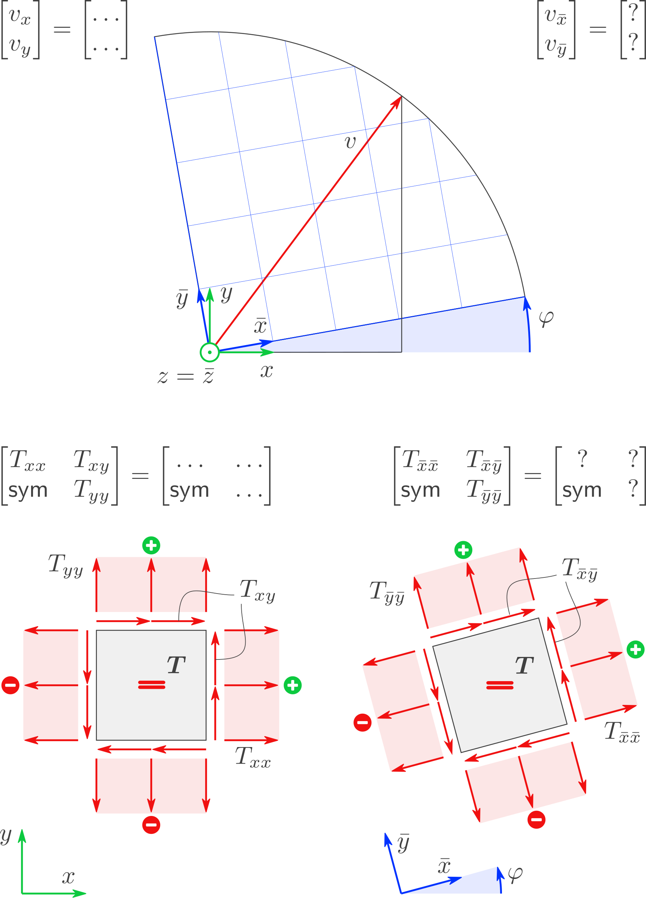

.. role:: raw-html(raw)
   :format: html

.. # define a hard line break for HTML

.. |br| raw:: html

    

.. _mohr:

Mohrscher Kreis
===============

.. .. admonition:: Language
..    :class: hint

..     * `de <file:///home/kai/A_Sphinx/Teach/mohr.tm-tutor.de/build/de/html/index.html>`_
..     * `en <file:///home/kai/A_Sphinx/Teach/mohr.tm-tutor.de/build/en/html/index.html>`_

.. admonition:: Thema
   :class: note

   Hier geht es um **Vektoren** und **Tensoren**. Und es geht darum, wofür man den **Mohrschen Kreis** verwendet.

   :raw-html:`

Wozu das?

`

   .. include:: ../../tm.tm-tutor.de/source/A/0/c1_vector/Intro/index.rst

   :raw-html:`

`

.. admonition:: Gegeben
   :class: hint

   * 
      Zwei Bezugssysteme:
      
      * das :math:`\left(x, y\right)`-Bezugssystem, genannt "das grüne" Bezugssystem
      * das :math:`\left(\bar x, \bar y\right)`-Bezugssystem, genannt "das blaue" Bezugssystem
   * 
      Ein Winkel :math:`\varphi`, um den das blaue Bezugssystem relativ zum grünen gedreht ist. Dieser Winkel wird gemessen:

      * ausgehend von :math:`x`
      * endend bei :math:`\bar x`
      * positiv um :math:`z =  \bar z`, wobei beide Bezugssysteme Rechtssysteme sind.
   * 
      Die :math:`\left(x, y\right)`-Komponenten eines **Vektors** bzw. eines symmetrischen **Tensors** in 2D:

      .. math::
         
         \begin{bmatrix} v_x \\ v_y \end{bmatrix}
         =
         \begin{bmatrix} \ldots \\ \ldots \end{bmatrix}
      
      .. math::
         :nowrap:
      
         \begin{align*}
         \begin{bmatrix}
         T_{xx} & T_{xy} \\
         \mathsf{sym} & T_{yy}
         \end{bmatrix}
         =
         \begin{bmatrix}
         \ldots & \ldots \\
         \mathsf{sym} & \ldots
         \end{bmatrix}
         \end{align*}

.. admonition:: Gesucht
   :class: warning

   :math:`\left(\bar x, \bar y\right)`-Komponenten dieses Vektors bzw. dieses Tensors:
   
   .. math::
      :nowrap:
      
      \begin{align*}
      \begin{bmatrix}
      v_{\bar x}  \\
      v_{\bar y}
      \end{bmatrix}
      &=
      \begin{bmatrix}
      \ldots  \\
      \ldots
      \end{bmatrix}
      \\
      \begin{bmatrix}
      T_{\bar x \bar x} & T_{\bar x\bar y} \\
      \mathsf{sym} & T_{\bar y\bar y}
      \end{bmatrix}
      &=
      \begin{bmatrix}
      \ldots & \ldots \\
      \mathsf{sym} & \ldots
      \end{bmatrix}
      \end{align*}

   Es gibt zwei Möglichkeiten zur Ermittlung dieser Komponenten:

   1. **Berechnung** mit **Matrizen**.
   2. **Ablesen** am **Mohrschen Kreis**.

.. toctree::
   :caption: Inhalt
   :maxdepth: 2

   Mohr/Intro/index
   Mohr/Vector/index
   Mohr/Tensor/index
   Mohr/3D/index

